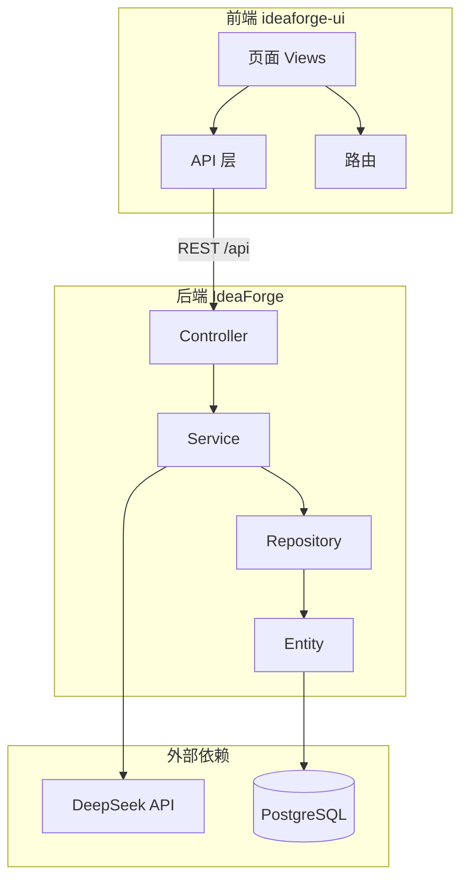

# IdeaForge

[](https://openjdk.org/)
[](https://spring.io/projects/spring-boot)
[](https://vuejs.org/)
[](https://vitejs.dev/)

**IdeaForge** 是一款开源的个人知识整理工具。将零散的想法、笔记与文档交给 AI 结构化处理，经人工确认后安全存入数据库，并支持检索、编辑与导出。

> **V1 已正式发布。** 本版本提供完整的录入、AI 整理、浏览检索、详情管理与类别字典能力。语义向量搜索等功能规划于 V2。

---

## 功能特性

| 能力 | 说明 |
|------|------|
| **AI 智能整理** | 基于 DeepSeek 大模型，自动生成标题、摘要、标签、类别与排版正文；支持 SSE 流式输出 |
| **两阶段确认流程** | AI 建议不落库，用户审阅编辑后再持久化，确保数据质量 |
| **文档导入** | 支持 `.docx` / `.pdf` 文本提取，解析后进入 AI 整理流程 |
| **关键词检索** | 按标题、摘要、正文、标签搜索，配合类别侧栏筛选与分页 |
| **富文本正文** | AI 输出 Markdown，前端转换为 HTML 存储；支持 WangEditor 查看与编辑 |
| **详情管理** | 查看、编辑、软删除已确认条目；支持基于原始或当前正文重新 AI 整理 |
| **Word 导出** | 单条知识条目一键导出为结构化 `.docx` 文档 |
| **类别字典** | 数据库维护类别，前端提供增删改管理，支持软删除与缓存 |

---

## 技术栈

| 层级 | 技术 |
|------|------|
| 后端 | Spring Boot 3.4.3 · Java 21 · Spring Data JPA · Spring AI |
| AI | DeepSeek API（`deepseek-v4-pro`） |
| 数据库 | PostgreSQL |
| 前端 | Vue 3 · Vite 8 · TypeScript · Element Plus · Pinia |
| 富文本 | WangEditor · marked · DOMPurify |
| 文档处理 | Apache POI（Word）· PDFBox（PDF）· Jsoup（HTML 解析） |

---

## 系统架构



**核心数据流：**

1. 用户提交原始文本（或上传文档）
2. 后端调用 DeepSeek 生成结构化建议（流式或同步）
3. 用户在前端确认或修改
4. 确认后写入 `knowledge_items` 表
5. 通过关键词与类别检索、浏览与管理

---

## 项目结构

```
IdeaForge-v/
├── README.md              # 项目总览（本文件）
├── .env.example           # 环境变量模板
├── db/
│   └── public.sql         # 数据库结构与种子数据参考
├── IdeaForge/             # 后端（Spring Boot）
│   ├── README.md
│   └── src/main/java/com/exam/ideaforge/
└── ideaforge-ui/          # 前端（Vue 3 + Vite）
    ├── README.md
    └── src/
```

---

## 环境要求

| 依赖 | 版本 |
|------|------|
| JDK | 21 |
| Maven | 3.x（或使用项目自带的 `mvnw`） |
| Node.js | ^20.19.0 或 >= 22.12.0 |
| PostgreSQL | 14+（建议安装 [pgvector](https://github.com/pgvector/pgvector) 扩展，V2 语义搜索预留） |
| DeepSeek API Key | [申请地址](https://platform.deepseek.com/) |

---

## 快速开始

### 1. 克隆仓库

```bash
git clone <repository-url>
cd IdeaForge-v
```

### 2. 初始化数据库

在 PostgreSQL 中创建数据库，并执行 [`db/public.sql`](db/public.sql) 中的表结构定义（或参考该文件自行建表）。

默认包含两张核心表：

- `knowledge_items` — 知识条目
- `idea_categories` — 类别字典（预置 WORK / STUDY / LIFE / INSPIRATION / TODO）

### 3. 配置环境变量

复制环境变量模板并填入真实值：

```bash
cp .env.example .env
```

| 变量 | 说明 |
|------|------|
| `DEEPSEEK_API_KEY` | DeepSeek API 密钥（必填） |
| `DB_PASSWORD` | PostgreSQL 密码 |

也可在启动前直接导出：

```bash
# Linux / macOS
export DEEPSEEK_API_KEY="sk-your-key"
export DB_PASSWORD="your-password"

# Windows PowerShell
$env:DEEPSEEK_API_KEY = "sk-your-key"
$env:DB_PASSWORD = "your-password"
```

> 数据库连接地址与用户名在 [`IdeaForge/src/main/resources/application.yml`](IdeaForge/src/main/resources/application.yml) 中配置，部署时请按实际环境修改 `spring.datasource.url` 与 `username`。

### 4. 启动后端

```bash
cd IdeaForge
./mvnw spring-boot:run        # Linux / macOS
# 或
.\mvnw.cmd spring-boot:run    # Windows
```

后端默认监听 `http://localhost:8080`。健康检查：`GET /api/health`。

### 5. 启动前端

```bash
cd ideaforge-ui
npm install
npm run dev
```

前端默认监听 `http://localhost:5173`。开发模式下，`/api` 请求通过 Vite 代理转发至后端。

---

## 页面与路由

| 路由 | 功能 |
|------|------|
| `/` | 首页：快速入口与最近知识 |
| `/create` | 录入：文本输入 / 文档上传 → AI 整理 → 保存 |
| `/browse` | 浏览：类别筛选 + 关键词搜索 + 分页列表 |
| `/ideas/:id` | 详情：查看、编辑、导出 Word、软删除 |
| `/settings/categories` | 设置：类别字典管理 |

---

## API 概览

完整接口说明见 [IdeaForge/README.md](IdeaForge/README.md)。

| 方法 | 路径 | 说明 |
|------|------|------|
| `POST` | `/api/ideas/process/stream` | SSE 流式 AI 整理（推荐） |
| `POST` | `/api/ideas/process` | 同步 AI 整理 |
| `POST` | `/api/ideas` | 确认保存 |
| `GET` | `/api/ideas/search` | 关键词 + 类别 + 分页搜索 |
| `GET` | `/api/ideas/{id}` | 获取详情 |
| `PUT` | `/api/ideas/{id}` | 更新条目 |
| `DELETE` | `/api/ideas/{id}` | 软删除 |
| `POST` | `/api/ideas/parse-document` | 文档解析（`.docx` / `.pdf`） |
| `GET` | `/api/ideas/{id}/export/docx` | 导出 Word |
| `GET/POST/PUT/DELETE` | `/api/categories` | 类别字典 CRUD |

---

## 配置说明

### 后端

配置文件：[`IdeaForge/src/main/resources/application.yml`](IdeaForge/src/main/resources/application.yml)

| 配置项 | 默认值 | 说明 |
|--------|--------|------|
| `server.port` | `8080` | 服务端口 |
| `spring.datasource.url` | — | PostgreSQL 连接地址 |
| `spring.datasource.password` | `${DB_PASSWORD}` | 数据库密码 |
| `spring.jpa.hibernate.ddl-auto` | `validate` | 表结构由 SQL 脚本维护 |
| `spring.ai.deepseek.chat.options.model` | `deepseek-v4-pro` | AI 模型 |
| `spring.servlet.multipart.max-file-size` | `10MB` | 文档上传大小限制 |

### 前端

开发代理配置：[`ideaforge-ui/vite.config.ts`](ideaforge-ui/vite.config.ts)

```ts
server: {
  proxy: {
    '/api': 'http://localhost:8080',
  },
}
```

生产部署时，需将前端构建产物与后端同域部署，或通过反向代理统一 `/api` 路径。

---

## 开发指南

### 后端分层

```
controller → service → repository → entity
```

- `entity` — JPA 实体映射
- `repository` — 数据访问
- `dto` — API 请求 / 响应对象
- `service` — 业务逻辑
- `controller` — REST 端点
- `config` / `exception` — 配置与全局异常处理

### 前端分层

```
views → components + api + stores
```

- `views/` — 页面级组件
- `components/` — 可复用 UI
- `api/` — HTTP 封装
- `stores/` — Pinia 全局状态
- `types/` — TypeScript 类型定义

### 常用命令

```bash
# 后端测试
cd IdeaForge && ./mvnw test

# 前端类型检查
cd ideaforge-ui && npm run typecheck

# 前端生产构建
cd ideaforge-ui && npm run build
```

---

## 已知限制

- 搜索基于 SQL `LIKE` 关键词匹配，不支持语义相似度检索（V2 规划 pgvector）
- 扫描版 PDF 无法提取文字，仅支持可选中文字的 PDF
- 文档上传单文件上限 10 MB
- 类别 `code` 创建后不可修改；软删除后历史条目仍保留原类别引用
- JPA `ddl-auto=validate`，数据库结构变更须通过 SQL 脚本执行，应用本身不自动建表

---

## 路线图

| 版本 | 状态 | 内容 |
|------|------|------|
| **V1** | 已发布 | AI 整理、持久化、关键词搜索、文档导入导出、类别管理、富文本 |
| **V2** | 规划中 | pgvector 语义搜索、Embedding 生成、Prompt 优化、批量导出 |

---

## 相关文档

- [IdeaForge/README.md](IdeaForge/README.md) — 后端 API 与包结构
- [ideaforge-ui/README.md](ideaforge-ui/README.md) — 前端目录与对接约定
- [db/public.sql](db/public.sql) — 数据库参考脚本

---

## 参与贡献

欢迎提交 Issue 与 Pull Request。贡献前请：

1. 阅读本 README 及子模块文档，了解项目结构与分层约定
2. 确保后端 `./mvnw test` 与前端 `npm run typecheck` 通过
3. 勿将 API 密钥、数据库密码等敏感信息提交至仓库

---

## 致谢

- [DeepSeek](https://www.deepseek.com/) — 大语言模型能力
- [Spring AI](https://spring.io/projects/spring-ai) — AI 集成框架
- [Vue.js](https://vuejs.org/) · [Element Plus](https://element-plus.org/) — 前端技术栈
