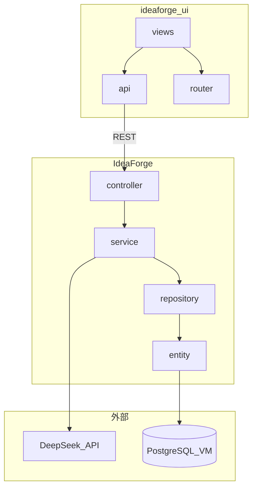

# IdeaForge

个人知识 / 想法整理工具。上传原始想法文本，由 DeepSeek 大模型智能整理为结构化信息，经用户确认后存入 PostgreSQL，并支持关键词检索。

## 开发前必读（本文件）

**每次开发前**，必须先完整阅读本 README.md（仅本文件，子模块 README 自行安排）。阅读完毕后，在对话或工作记录中输出：

```
易----大开工！
```

**每次开发完成后**，必须更新本 README.md 中的进度、已知问题等与本次改动相关的内容（子模块 README 自行维护）。更新完毕后，输出：

```
易----屎山完成！
```

## 项目简介

**V1.5 新增能力：**

1. **首页**（`/`）— 快速录入 / 浏览入口，展示最近知识
2. **浏览**（`/browse`）— 左侧类别导航 + 关键词搜索 + 可点击结果列表
3. **详情**（`/ideas/:id`）— 查看完整条目，支持导出 Word
4. **文档上传** — 录入页支持 `.docx` / `.pdf`，解析后填入表单再走 AI 整理
5. **Word 导出** — 详情页一键下载结构化 `.docx`
6. **详情编辑** — 详情页可编辑标题、摘要、标签、类别、排版正文
7. **富文本正文** — AI 整理输出 Markdown，前端 WangEditor 转 HTML 存储；详情页富文本查看与编辑

**V1 核心流程：**

1. 用户上传原始想法（标题 + 正文）
2. 系统调用 DeepSeek（`deepseek-v4-pro`）生成建议标题、一句话摘要、标签、类别
3. 前端展示结果，用户可编辑后确认
4. 确认后持久化至 PostgreSQL
5. 通过关键词搜索已有知识条目

**当前进度：**

| 模块 | 状态 |
|------|------|
| 后端脚手架 | 已完成（`pom.xml`、`application.yml`、启动类） |
| 后端连通 | 已完成（`/api/health`、`WebConfig` CORS、环境变量配置） |
| 前端脚手架 | 已完成（`ideaforge-ui`，Vue 3 + Vite 8） |
| 前后端联调 | 已完成（Vite proxy、全链路 API 测试通过） |
| 后端业务 | 已完成（Entity / Repository / DTO / Service / Controller / 异常处理） |
| 前端业务 | 已完成（vue-router、axios、各 View + components） |
| 前端 UI | 已完成（首页、侧栏类别导航、共享设计系统） |
| V1 核心流程 | 已完成（AI 整理 → 确认保存 → 关键词搜索） |
| V1.5 浏览与详情 | 已完成（首页、BrowseView、IdeaDetailView、左侧类别导航） |
| V1.5 文档上传 | 已完成（`.docx` / `.pdf` 解析 → 录入页填充 → AI 整理） |
| V1.5 Word 导出 | 已完成（详情页导出 `.docx`，排版分段） |
| V1.6 详情编辑 | 已完成（PUT 更新最终字段） |
| V1.6 AI 正文排版 | 已完成（`final_content` 富文本 HTML，WangEditor） |
| 标签/类别搜索 | 已修复（关键词与类别分离；类别用侧栏筛选） |
| 类别字典化 | 已完成（`idea_categories` 表 + CRUD API + 前端类别管理页） |
| 浏览软删除 | 已完成（`DELETE /api/ideas/{id}`，status=deleted，浏览不可见） |
| 搜索分页 | 已完成（`GET /api/ideas/search?page=&size=`，BrowseView 分页器） |
| 编辑页 AI 重新整理 | 已完成（原始正文 / 当前排版正文双来源，保存同步 suggested 字段） |
| AI 流式整理 (SSE) | 已完成（`POST /api/ideas/process/stream`，前端打字机预览 suggestedContent） |
| 向量语义搜索 | V2 规划（V1 使用关键词搜索） |

## 项目结构

```
IdeaForge-v/
├── README.md                 # 本文件（项目总览 + 全局规范）
├── db/
│   ├── public.sql            # VM 数据库参考脚本
│   ├── migrate_idea_categories.sql  # 类别字典表迁移脚本
│   ├── migrate_final_content.sql    # 排版正文字段迁移
│   └── migrate_soft_delete.sql      # 知识条目软删除 status 扩展
├── IdeaForge/                # 后端（Spring Boot）
│   ├── README.md             # 后端专项说明
│   └── src/main/java/com/exam/ideaforge/
└── ideaforge-ui/             # 前端（Vue 3 + Vite）
    ├── README.md             # 前端专项说明
    └── src/
```

## 技术栈

| 层级 | 技术 | 版本 / 说明 |
|------|------|-------------|
| 后端框架 | Spring Boot | 3.4.3 |
| 语言 | Java | 21 |
| 构建 | Maven | wrapper（`mvnw`） |
| AI 集成 | Spring AI + DeepSeek | 1.1.0 / `deepseek-v4-pro` |
| 持久化 | Spring Data JPA + PostgreSQL | VM `192.168.226.131:5432/knowledge_db` |
| 前端 | Vue 3 + Vite | ^3.5 / ^8.0（JavaScript） |
| 向量检索（V2） | pgvector | V1 暂不启用，使用关键词搜索 |

**前端已安装依赖：** vue-router、axios、@wangeditor/editor、marked、dompurify

**前端规划依赖（待安装，新增须评审）：** Element Plus

## 系统架构（V1）



## 开发规范：按包 / 目录职责管理

**总则：** 每个包（后端）或目录（前端）有且仅有一种职责。新增代码必须先确定归属，禁止把业务逻辑、API 调用、页面 UI 混写在同一文件里；禁止跨层调用（如 Controller 直接操作 Repository、View 直接写 fetch）。

### 后端包职责（`com.exam.ideaforge`）

| 包 | 职责 | 允许 | 禁止 |
|----|------|------|------|
| `entity` | 数据库表映射 | JPA 注解、字段、关联 | 业务逻辑、HTTP、调用 AI |
| `repository` | 数据访问 | JpaRepository、@Query | 业务规则、DTO 转换 |
| `dto` | API 入参 / 出参 | 字段、校验注解 | 业务逻辑、数据库操作 |
| `service` | 业务逻辑 | 调用 Repository、DeepSeek、事务 | 处理 HTTP 细节 |
| `controller` | REST 接口 | 参数校验、调用 Service、返回响应 | 业务逻辑、直接访问 DB |
| `config` | Spring 配置 | CORS、Bean 定义 | 业务逻辑 |
| `exception` | 异常处理 | 自定义异常、@ControllerAdvice | 业务逻辑 |

**依赖方向（单向）：** `controller → service → repository → entity`；`dto` 仅在 controller 与 service 边界使用，不进入 repository。

### 前端目录职责（`ideaforge-ui/src`）

| 目录 / 文件 | 职责 | 允许 | 禁止 |
|-------------|------|------|------|
| `views/` | 页面级组件（对应路由） | 布局、组合 components、调用 api | 直接写 axios/fetch、复杂可复用 UI |
| `components/` | 可复用 UI 组件 | 展示、事件 emit | 直接调用后端 API |
| `router/` | 路由定义 | path、component 映射 | 业务逻辑、API 调用 |
| `api/` | 后端 HTTP 封装 | axios 请求、URL 常量 | DOM 操作、页面状态 |
| `assets/` | 静态资源 | css、图片、字体 | JS 逻辑 |
| `App.vue` | 根布局壳 | 导航栏、`<router-view>` | 具体页面业务 |
| `main.js` | 应用入口 | createApp、插件注册 | 业务代码 |

**依赖方向（单向）：** `views → components + api`；`api` 不依赖 `views` / `components`。

### 跨模块约定

- API 路径统一前缀 `/api`；前后端字段命名保持一致（camelCase）
- 后端改 DTO 字段时，同步修改前端 `api/` 与 `views/`；前端不假设未实现的接口
- 可复用逻辑：后端放 `service`，前端放 `components/` 或 `api/`，不随意新建平行包 / 目录

## 协作与开发注意事项

### 文件变更

- **不得擅自新增或删除文件 / 目录**；任何新包、新目录、删文件须先经评审确认
- 新增文件必须能对应上文职责表中的某一类；若无法归类，先讨论再建
- 优先在已有文件中扩展，而非重复造轮子

### 模块隔离

- 修改某一包 / 目录时，**不得破坏其他模块已有功能与逻辑**
- 后端各包之间、前后端之间通过明确接口（DTO / REST）通信

### 全局视角

- 开发前先查现有代码，**能复用则复用**（如同一 Service 处理保存与搜索的数据组装）
- 避免「每个功能新建一个 Controller / Service / View」；先评估是否扩展现有类
- 配置集中管理：后端 `application.yml`，前端 `vite.config.js`（proxy 等）
- 密钥、密码仅通过环境变量注入，**禁止提交到 Git**

### 已知问题

- JPA `ddl-auto` 已改为 `validate`（VM 表由 DBA 维护，应用用户无 ALTER 权限）
- `status` 字段数据库存储小写（`pending` / `confirmed` / `deleted`），通过 `ItemStatusConverter` 映射
- **知识条目软删除**：须执行 [`db/migrate_soft_delete.sql`](db/migrate_soft_delete.sql) 扩展 status CHECK 约束，否则软删除写入失败
- `logo.png` 体积较大（约 4.6 MB），后续可压缩以加快首屏加载
- 类别改由 PostgreSQL 表 `idea_categories` 维护，前端「类别管理」页可增改删（软删除）；**部署前须在 VM 执行** [`db/migrate_idea_categories.sql`](db/migrate_idea_categories.sql)（或参考 `public.sql`），否则应用启动 validate 失败
- **排版正文字段**：须执行 [`db/migrate_final_content.sql`](db/migrate_final_content.sql) 添加 `suggested_content` / `final_content` 列
- 类别 `code` 创建后不可修改；软删除（`enabled=false`）后管理页不再显示，历史条目保留；后期可在 DB 手动 `DELETE` 硬删
- 类别筛选：浏览页**左侧类别导航**（全部 + 各类别）；关键词搜索框不再匹配类别
- 文档上传：扫描版 PDF 无法提取文字；单文件上限 10MB
- 浏览页搜索支持分页（默认每页 20 条，最大 100 条）；URL 参数 `page`（0-based）可分享当前页
- 标签搜索依赖 `final_tags` 正确入库；旧数据若 `final_tags` 为 NULL，需重新保存或手动补数据

## 环境要求

- JDK 21
- Maven（或使用 `IdeaForge/mvnw`）
- Node.js ^20.19.0 或 >=22.12.0（前端）
- VM 上 PostgreSQL 可远程访问
- DeepSeek API Key（环境变量）

## 快速开始

### 1. 配置环境变量

复制 [`.env.example`](.env.example) 为 `.env` 并填入真实值（`.env` 已 gitignore，不会提交），或手动设置：

```powershell
$env:DEEPSEEK_API_KEY = "sk-你的密钥"
$env:DB_PASSWORD = "root"   # 若数据库密码不同则修改
```

### 2. 确认数据库连通

从开发机测试 VM PostgreSQL：`192.168.226.131:5432/knowledge_db`

**首次部署类别字典化版本时**，请 DBA 在 VM 执行：

```sql
-- 见 db/migrate_idea_categories.sql
```

### 3. 启动后端

```powershell
cd IdeaForge
.\mvnw.cmd spring-boot:run
```

后端地址：`http://localhost:8080`

### 4. 启动前端

```powershell
cd ideaforge-ui
npm install
npm run dev
```

前端地址：`http://localhost:5173`

## 开发阶段建议

按模块、按层次推进，不跳层：

1. **后端：** `entity` → `repository` → `dto` → `service` → `controller`
2. **前端：** `api/` → `router/` + `views/` → `components/`
3. **联调与验收**

## V1 功能范围

| 功能 | V1 / V1.5 | V2（规划） |
|------|-----------|-----------|
| AI 整理 | DeepSeek `deepseek-v4-pro` | 同左，可优化 Prompt |
| 数据持久化 | PostgreSQL + JPA | 同左 |
| 搜索 | 关键词匹配（LIKE）+ 类别侧栏 | pgvector 语义搜索 |
| 类别管理 | DB 字典 + 前端 CRUD | 同左 |
| 文档导入 | `.docx` / `.pdf` 文本提取 | 可扩展 OCR |
| Word 导出 | 单条详情导出排版 `.docx` | 批量导出 |
| 详情编辑 | PUT 更新最终字段 | 同左 |
| 正文排版 | WangEditor 富文本（HTML 存储，兼容历史 Markdown） | 可扩展更多格式 |
| Embedding 模型 | 不需要 | 需额外接入 |

## 相关文档

- [IdeaForge/README.md](IdeaForge/README.md) — 后端包细则、配置、API 规划
- [ideaforge-ui/README.md](ideaforge-ui/README.md) — 前端目录细则、对接约定
- [db/public.sql](db/public.sql) — 数据库参考脚本
- [db/migrate_idea_categories.sql](db/migrate_idea_categories.sql) — 类别字典表迁移
